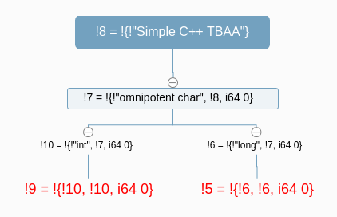

# I-learn-TBAA
This is how I learn TBAA
## Introduction
TBAA (Type-Based Alias Analysis) in LLVM is an optimization that remove unneeded
computations (for example, from loop) based on type information[1]. 

For example, consider following two functions (tbaa3.cpp):
```
1  void bar(int *x, long *y) {
2    for (int i = 0; i < 1000; ++i)
3        x[i] = *y + 42;
4  }
                                                                                                               
5  void foo(int *x, int *y) {  
6    for (int i = 0; i < 1000; ++i)
7        x[i] = *y + 42; 
8  }  
```
In function bar, because 'int' and 'long' are different types, store to x[i] in line 3 
can not affect the values in y, 
so we can optimize the load of y outside of the loop. But, in function foo, 
x and y have same type 'int', store to x[i] in line 7 may affect the values in y, we can
not optimize the load of y outside of the loop.

## LLVM TBAA Process

Now we see how LLVM actually do to optimize above code by invoking:

$clang++ -S -O -emit-llvm tbaa3.cpp

We get tbaa3.ll which is in form of LLVM IR (LLVM IR is a low-level intermediate representation used by the LLVM compiler framework)

Let's examine generated LLVM IR of function bar which is a little lengthy (tbaa3.ll) 

```
 7 define dso_local void @_Z3barPiPl(ptr nocapture noundef writeonly %x, ptr nocapture noundef readonly %y) local_unnamed_addr #0 {
 8 entry:
 9  %0 = load i64, ptr %y, align 8, !tbaa !5
10  %1 = trunc i64 %0 to i32
11  %conv = add i32 %1, 42
12  br label %for.body
13
14 for.cond.cleanup:                                 ; preds = %for.body
15  ret void
16
17 for.body:                                         ; preds = %entry, %for.body
18  %indvars.iv = phi i64 [ 0, %entry ], [ %indvars.iv.next, %for.body ]
19  %arrayidx = getelementptr inbounds i32, ptr %x, i64 %indvars.iv
20  store i32 %conv, ptr %arrayidx, align 4, !tbaa !9
21  %indvars.iv.next = add nuw nsw i64 %indvars.iv, 1
22  %exitcond.not = icmp eq i64 %indvars.iv.next, 1000
23  br i1 %exitcond.not, label %for.cond.cleanup, label %for.body, !llvm.loop !11
24 }

55 !5 = !{!6, !6, i64 0}
56 !6 = !{!"long", !7, i64 0}
57 !7 = !{!"omnipotent char", !8, i64 0}
58 !8 = !{!"Simple C++ TBAA"}
59 !9 = !{!10, !10, i64 0}
60 !10 = !{!"int", !7, i64 0}

```

Let explain what's above LLVM IR mean. Line 7 'define' means this is a function define instead of a 'declare', 'dso_local' means this function will resolve to a symbol within the same linkage unit (I did a little exploration of 'dso_local' in [dso_local](dso_local.md)).




## References
[1] https://stefansf.de/post/type-based-alias-analysis/

[2] https://llvm.org/docs/LangRef.html#tbaa-metadata

[3] https://llvm.org/doxygen/TypeBasedAliasAnalysis_8cpp_source.html

## Acknowledgements
Thank MaskRay (Fangrui Song) for teaching me to use fenced code block which make the paper much better. Thank Mingjie Xu for teaching me the technique details of TBAA in LLVM. Thank Prof Wenchang Shi for your encouragement.
