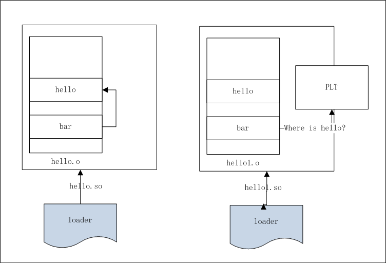

# My Little Exploration of 'dso_local'
This is my little exploration of dso_local
## Introduction
Official document of LLVM says "'dso_local' means this function will resolve to a symbol within the same linkage unit". As a beginner, I think I need some example to understand that definition, so I did some exploration.
## Generate example LLVM IR
Firstly I construct a C program:

```
void hello() {
}
int bar()
{
        hello();
        return 0;
}
```

Then I use clang to generate LLVM IR: clang -S -emit-llvm hello.c, I get [hello.ll](examples/hello.ll))

```
define dso_local void @hello() #0 {
  ret void
}

; Function Attrs: noinline nounwind optnone uwtable
define dso_local i32 @bar() #0 {
  call void @hello()
  ret i32 0
}
```

Then I copy hello.ll to hello1.ll: cp hello.ll hello1.ll, and remove dso_local definition from function hello, I get [hello1.ll](examples/hello1.ll)


```
define void @hello() #0 {
  ret void
}

; Function Attrs: noinline nounwind optnone uwtable
define dso_local i32 @bar() #0 {
  call void @hello()
  ret i32 0
}
```
## Compile LLVM IR to assembly files
By invoking: llc  -relocation-model=pic hello.ll, I get hello.s

By invoking: llc  -relocation-model=pic hello1.ll, I get hello1.s

I can see the difference between hello.s and hello1.s, diff -u hello.s hello1.s:
```
 hello:                                  # @hello
-.Lhello$local:
 	.cfi_startproc
 # %bb.0:
 	pushq	%rbp
@@ -31,7 +30,7 @@
 	.cfi_offset %rbp, -16
 	movq	%rsp, %rbp
 	.cfi_def_cfa_register %rbp
-	callq	.Lhello$local
+	callq	hello@PLT
 	xorl	%eax, %eax
 	popq	%rbp
 	.cfi_def_cfa %rsp, 8
```
PLT mean position 'procedure linkage table' 
## Assemble assembly file to object files
By invoking: clang++ -fpic -c hello.s, I get hello.o

By invoking: clang++ -fpic -c hello1.s, I get hello1.o
## Display linkage information
By invoking: objdump -d hello.o, I get
```
0000000000000000 <hello>:
   0:	55                   	push   %rbp
   1:	48 89 e5             	mov    %rsp,%rbp
   4:	5d                   	pop    %rbp
   5:	c3                   	ret    
   6:	66 2e 0f 1f 84 00 00 	cs nopw 0x0(%rax,%rax,1)
   d:	00 00 00 

0000000000000010 <bar>:
  10:	55                   	push   %rbp
  11:	48 89 e5             	mov    %rsp,%rbp
  14:	e8 e7 ff ff ff       	call   0 <hello>
  19:	31 c0                	xor    %eax,%eax
  1b:	5d                   	pop    %rbp
  1c:	c3                   	ret  

```

At offset 0x14, 'e8' is a Intel call with a relative offset, 'e7 ff ff ff' is 32 bit signed number -25, 
offset of next instruction is 0x19, 0x19 - 25 = 0, 0 is exactly the offset of function hello.  

By invoking: objdump -d hello1.o, I get
```
0000000000000000 <hello>:
   0:	55                   	push   %rbp
   1:	48 89 e5             	mov    %rsp,%rbp
   4:	5d                   	pop    %rbp
   5:	c3                   	ret    
   6:	66 2e 0f 1f 84 00 00 	cs nopw 0x0(%rax,%rax,1)
   d:	00 00 00 

0000000000000010 <bar>:
  10:	55                   	push   %rbp
  11:	48 89 e5             	mov    %rsp,%rbp
  14:	e8 00 00 00 00       	call   19 <bar+0x9>
  19:	31 c0                	xor    %eax,%eax
  1b:	5d                   	pop    %rbp
  1c:	c3                   	ret 
```

At offset 14, the 32 bit offset of Intel 'e8' call is 0, which will filled later by linker and loader.

By invoking llvm-readelf -r hello1.o, I get:
```
Relocation section '.rela.text' at offset 0x150 contains 1 entries:
    Offset             Info             Type               Symbol's Value  Symbol's Name + Addend
0000000000000015  0000000300000004 R_X86_64_PLT32         0000000000000000 hello - 4
```

Which means we need loader and linker fill (relocate) the content (the 32 bit offset field of Intel 'e8' call) at offset 15 of text section.  
## Runtime
 
 
We can see from above figure that in hello.so (link unit) function hello is resoved within the link unit, while in hello1.so (link unit) function hello is resolved externally by looking up PLT (Procedure Linkage Table)
## Conclusion
dso_local tells loader and linker to resolve the function within the link unit.
